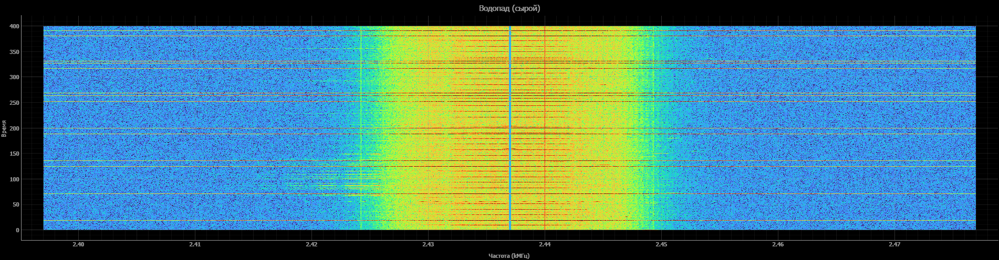

# ESP32 Spectrum Analyzer


Real-time 2.4 GHz spectrum analyzer and waterfall viewer for ESP32-based ESP-SDR. Streams raw I/Q over UART, processes FFT in Python, and visualizes spectrum + waterfall with absolute frequency axis, CRC validation, and adaptive color levels.


<!-- Replace with your own screenshot in the docs/ folder -->

---

## ✨ Features

- **Real-time I/Q streaming** from ESP32 over UART (1 Mbit/s)
- **Spectrum + waterfall** in a single window (`pyqtgraph`)
- **Absolute frequency axis** — e.g. 2402…2422 MHz instead of −10…+10 MHz
- **Configurable view span** (`VIEW_SPAN_MHZ`)
- **Hann window** to reduce spectral leakage
- **Power averaging** (for spectrum) — smooth image without noise
- **Raw frames** (for waterfall) — Wi-Fi/Bluetooth pulses stay visible
- **CRC-32 validation** per frame — drops corrupted packets
- **Adaptive color map levels** (5/95 percentiles)
- **DC bin masking** — removes the Zero-IF artifact
- **I/Q swap** — matches the ESP-SDR web interface
- **Center frequency marker** on both plots

---

## 🛠 Hardware

| Component | Model | Notes |
|---|---|---|
| MCU | ESP32 DevKit V1 | Classic ESP32, not S2/S3 |
| USB-UART | CH340C | On the DevKit board |
| Connector | USB Type-C | Power + data |
| Antenna | On-board PCB | Can be replaced with an external 2.4 GHz antenna |

**Power:** 5 V via USB or external PSU ≥1 A (Wi-Fi peaks up to 500 mA).

---

## 💻 Software

### Requirements

- **Python 3.13+**
- **ESP-SDR firmware** — [ESPARGOS/esp-sdr](https://github.com/ESPARGOS/esp-sdr), GPL-3.0-or-later
- **CH340 driver** — [wch-ic.com](https://www.wch-ic.com/downloads/CH341SER_EXE.html)

### Python dependencies
- **pyserial>=3.5**
- **numpy>=1.21**
- **pyqtgraph>=0.13**
- **PyQt5>=5.15**

---

## 🚀 Installation

### 1. Flash ESP32

Download and flash [ESP-SDR](https://github.com/ESPARGOS/esp-sdr) following the instructions in their repository.

> **Note:** the firmware is a separate project distributed under GPL-3.0-or-later. This repository contains only the Python client.

After flashing, the ESP32 will appear as a COM port (`USB-SERIAL CH340`) when plugged in via USB.

### 2. Python client

```bash
# Clone the repository
git clone https://github.com/<username>/esp32-spectrum-analyzer.git
cd esp32-spectrum-analyzer

# Create a venv (recommended)
python -m venv venv

# Activate
venv\Scripts\activate          # Windows
source venv/bin/activate       # Linux/macOS

# Install dependencies
pip install -r requirements.txt

```
## 🎮 Usage

1. **Connect the ESP32** via USB.
2. **Find the COM port** — Device Manager → "Ports (COM & LPT)" → `USB-SERIAL CH340 (COMx)`.
3. **Open `realtime.py`** and set your port:

   ```python
   PORT = 'COM3'      # ← change this
   ```

4. **Close all ESP-SDR browser tabs** — they hold the COM port.
5. **Run:**

   ```bash
   python realtime.py
   ```

### What you'll see

- **Top — spectrum** (averaged): power (dB) vs frequency (MHz).
- **Bottom — waterfall** (raw): frequency on X, time on Y, newest on top.
- **Red dashed line** — center frequency.
- **Window title** — center frequency and current FPS.

### Controls

- **Mouse wheel** — zoom axes.
- **LMB + drag** — pan.
- **RMB** — context menu (reset zoom, export).

---

## ⚙️ Configuration

All parameters are at the top of `main.py`:

| Parameter | Default | Description |
|---|---|---|
| `PORT` | `'COM3'` | ESP32 COM port |
| `BAUD` | `1000000` | UART baud rate |
| `FREQ_MHZ` | `2412` | Center frequency (MHz) |
| `N_SAMPLES` | `4096` | Samples per frame (FFT bins) |
| `RATE` | `0` | 0 = 80 MHz, 1 = 40 MHz, 6 = 16 MHz |
| `CAP_FORMAT` | `20` | 20 = 10-bit I/Q, 16 = 8-bit |
| `WF_HEIGHT` | `400` | Waterfall history rows |
| `AVG_COUNT` | `8` | Spectrum averaging frames |
| `V_MIN, V_MAX` | `5, 45` | dB levels for waterfall palette |
| `ADAPTIVE_LEVELS` | `True` | Auto-tune levels via percentiles |
| `CHECK_CRC` | `True` | Validate CRC-32 for each frame |
| `VIEW_SPAN_MHZ` | `20` | View span around center |

### Valid frequencies

The firmware accepts **only Wi-Fi channel** frequencies:

```
2412, 2417, 2422, 2427, 2432, 2437, 2442, 2447,
2452, 2457, 2462, 2467, 2472, 2484
```

Intermediate values → `ERR command` from ESP32.

### UART speed

The firmware boots at **2 Mbit/s**. To switch to **1 Mbit/s** (more stable on CH340C), run once:

- portChanger.py

After an ESP32 reset, it returns to 2 Mbit/s.

## 🏗 Architecture

```
┌─────────────────┐     UART 1 Mbit/s      ┌──────────────────┐
│                 │ ─────────────────────► │                  │
│   ESP32         │    Raw I/Q (20 bytes   │   Python         │
│   ESP-SDR       │    per 2 samples, CRC) │   client         │
│   (firmware)    │                        │   (this repo)    │
│                 │ ◄───────────────────── │                  │
│                 │   Commands: FREQ, CAP20│                  │
└─────────────────┘                        └──────────────────┘
                                                    │
                                                    ▼
                                          ┌──────────────────┐
                                          │ FFT + Hann window│
                                          │ Spectrum +       │
                                          │ waterfall        │
                                          │ (pyqtgraph)      │
                                          └──────────────────┘
```

### Data flow

1. **Command `CAP20 <n> <rate>`** → ESP32 captures I/Q via the MAC block.
2. **Response:** `DATA <n> <crc32> <elapsed>\n` + binary samples.
3. **Python:** parse 10-bit I/Q, sign-extend, I/Q swap.
4. **Processing:** DC removal, Hann window, FFT, fftshift.
5. **Visualization:** averaged spectrum + raw waterfall.

### CAP20 data format

5 bytes = 2 samples × 20 bits:

```
byte[0] = a[7:0]
byte[1] = a[15:8]
byte[2] = a[19:16] | (b[3:0] << 4)
byte[3] = b[11:4]
byte[4] = b[19:12]
```

Inside each 20-bit word: `I = w & 0x3FF`, `Q = (w >> 10) & 0x3FF`.

---

## 🐛 Known issues

| Issue | Fix |
|---|---|
| Port busy | Close the ESP-SDR browser tab |
| ESP32 doesn't respond at 1 Mbit/s | Open at 2 Mbit/s first, send `BAUD 1000000` |
| Mirrored spectrum | Check I/Q swap in `parse20`/`parse16` |
| Low FPS | Reduce `N_SAMPLES` or set `CAP_FORMAT = 16` |
| Many `CRC err` | Lower baud to 1 Mbit/s or check the cable |
| Flat waterfall | Tune `V_MIN, V_MAX` or enable `ADAPTIVE_LEVELS` |

---

## 🗺 TODO / Roadmap

- [ ] Firmware patch: replace `vTaskDelay(1)` → `esp_rom_delay_us(100)` (FPS ×5–10)
- [ ] Channel scanner 2412 → 2472 MHz with occupancy map
- [ ] Occupancy logging to CSV over 24 hours
- [ ] Waterfall export to PNG / NPZ
- [ ] Pause, frequency switch, and save buttons
- [ ] Signal detector & classifier (Wi-Fi / BT / microwave)
- [ ] I/Q imbalance compensation
- [ ] RTL-SDR support as a second source

---

## 🙏 Credits

This project is built on top of the [ESP-SDR](https://github.com/ESPARGOS/esp-sdr) firmware by [ESPARGOS](https://github.com/ESPARGOS). The I/Q capture mechanism is their discovery.

Big thanks to the authors of:
- **ESP-IDF** — Espressif's framework for ESP32
- **pyqtgraph** — fast real-time visualization
- **numpy** — signal processing
- **pyserial** — UART communication

---

## 📜 License

**MIT License** — see [LICENSE](LICENSE).

The Python client is an independent program that uses the public UART protocol of ESP-SDR. The ESP-SDR firmware is **not included** in this repository and is distributed separately under GPL-3.0-or-later.

```
MIT License

Copyright (c) 2025 <Your Name>

Permission is hereby granted, free of charge, to any person obtaining a copy
of this software and associated documentation files (the "Software"), to deal
in the Software without restriction, including without limitation the rights
to use, copy, modify, merge, publish, distribute, sublicense, and/or sell
copies of the Software, and to permit persons to whom the Software is
furnished to do so, subject to the following conditions:

The above copyright notice and this permission notice shall be included in all
copies or substantial portions of the Software.

THE SOFTWARE IS PROVIDED "AS IS", WITHOUT WARRANTY OF ANY KIND, EXPRESS OR
IMPLIED, INCLUDING BUT NOT LIMITED TO THE WARRANTIES OF MERCHANTABILITY,
FITNESS FOR A PARTICULAR PURPOSE AND NONINFRINGEMENT. IN NO EVENT SHALL THE
AUTHORS OR COPYRIGHT HOLDERS BE LIABLE FOR ANY CLAIM, DAMAGES OR OTHER
LIABILITY, WHETHER IN AN ACTION OF CONTRACT, TORT OR OTHERWISE, ARISING FROM,
OUT OF OR IN CONNECTION WITH THE SOFTWARE OR THE USE OR OTHER DEALINGS IN THE
SOFTWARE.
```

---

## 📬 Contact

- GitHub: [@<username>](https://github.com/<SLIIV>)
- Email: ytanteioff@gmail.com

Questions, ideas, bug reports → [Issues](https://github.com/SLIIV/esp32-spectrum-analyzer/issues).
