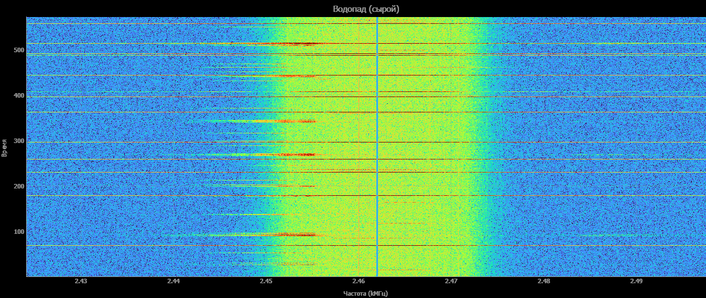
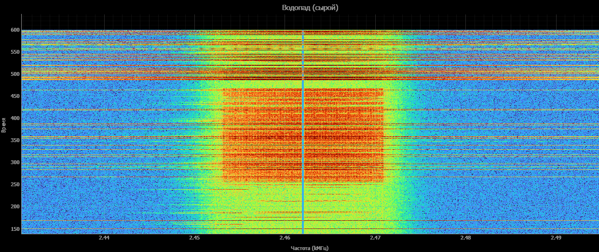
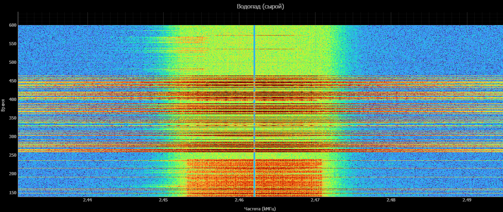
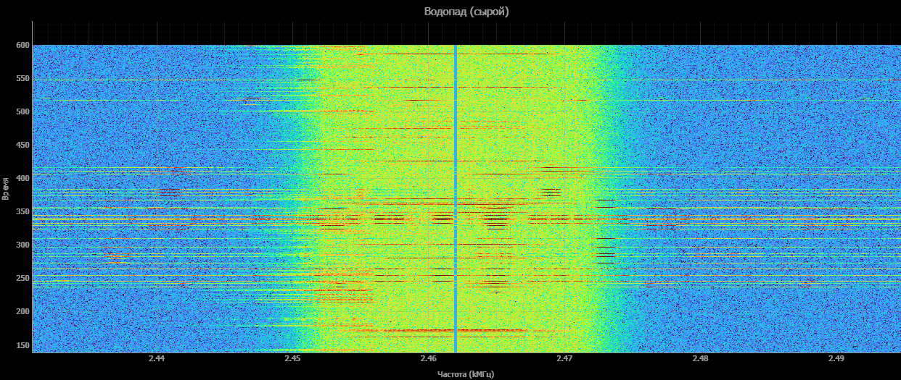

# Сравнительный анализ спектограммы WI-FI радиосигнала 2462 mHz при условии использования этой частоты двумя роутерами

#### Вводные данные
- Оба роутер работают на 11 канале на частоте 2462 mHz.
- Расстояние от считывающего устройста до первого роутера ~4 метров
- Расстояние от считывающего устройства до второго роутера ~16 метров
- Замеры сделаны вечером от 21:00 до 22:50 по местному времени, что не удовлетворяет условиям чистоты данных. Требуется перезапись в более узкий промежуток времени.

1) Спектограмма wi-fi сигнала без дополнительно нагрузки:
   Время: 22:51
   
   На данном кадре изображена спектограмма нормальной работы сети без дополнительной нагрузки. В данном случае на изображении видны явные шумы по всей горизонтали с нижним порогом более 40 дБ; достаточно сильный, в районе 80 дБ сигнал на частоте 2450 - 2455 mHz длительностью ~0.33 сек. и частотой 0,25 сигналов в секунду (1 всплеск раз в 4 секунды). Наиболее стабильный сигнал обнаруживается на частоте 2460 mHz. 
2) Скачивание.
   Замеры проводились с помощью сервиса по замеру скорости интернета. Получил неоднозначные результаты. В первый период времени (1ый скриншот) мы видим четкую картинку пакетов, которые посылает роутер. Второй скришот при тех же условиях через 2 часа и после перезагрузки роутера не дает того же результата. Требуется выявить причину.
   
3) Выгрузка
   Во время выгрузки происходит обратная ситуация. Мы получаем широкие горизонтальные полосы по всей длине спектра.
   
5) bluetooth сигнал
   Во время поиска раздачи bluetooth сигнала телфона без какого-либо стороннего подключения мы видим явные широкополсные помехи
   
